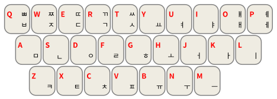

# Rime韩文（可汉谚混写）输入方案

译文：[繁體中文](README_translation/README_zh-HANT.md)

## 简介

这是一个基于[Rime](https://rime.im/)的韩文（可汉谚混写）输入方案。可以以形码的方式，方便地输入谚文和汉字。

## 特性

- 采用最常见的[두벌식键盘布局](https://ko.wikipedia.org/wiki/%EB%91%90%EB%B2%8C%EC%8B%9D_%EC%9E%90%ED%8C%90)

- 支持Unicode已收录的所有谚文音节组合

  [Hangul Syllables](https://www.unicode.org/charts/PDF/UAC00.pdf)

- 实时组合所输入的谚文音节

  输入码会实时转换成合法的谚文音节，提高交互性。

- 单汉字的读音全部来自[Unihan数据库](https://www.unicode.org/charts/unihan.html)

  能输入Unihan数据库中有朝鲜语音读的所有汉字。

## 安装指南

1. 安装好对应平台的输入法（安装地址见[Rime官网下载页](https://rime.im/download/)）；

2. 将`koreanMT.schema.yaml`和`koreanMT.dict.yaml`添加到用户文件夹；
4. 重新部署您的输入法
5. 切换到`朝鲜文_MT`使用输入法

## 使用说明

### 键盘布局

<figure>
    
    <figcaption style="text-align: center; color: rgba(0, 0, 0, 60%); font-size: 0.85em">图1. 键盘布局</figcaption>
</figure>

## 贡献

可通过Pull Request来进行代码贡献和Issue来提出问题。

## 协议

以MIT协议发布。